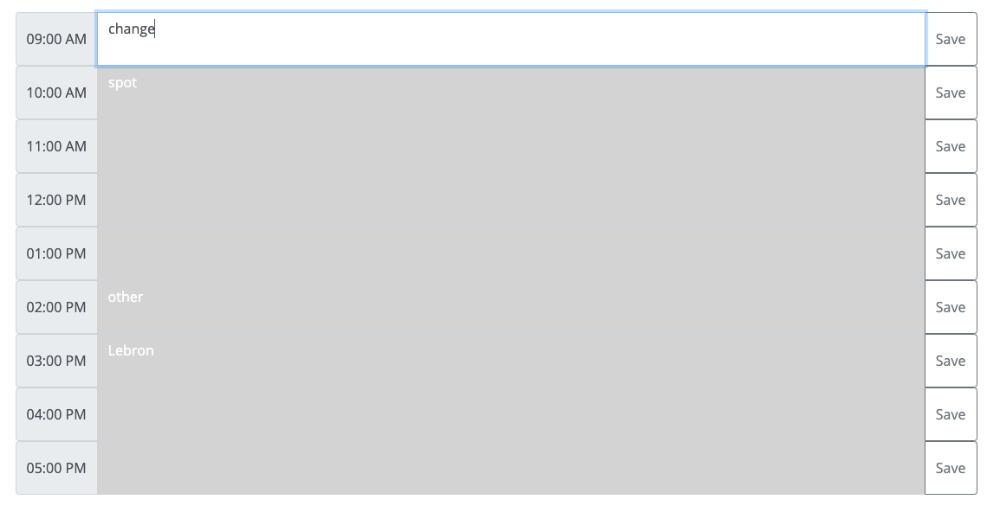

# Work_Day_Scheduler_AlexPalmer

1. Description
2. Web Address
3. Usage Tips

Description:

Header --> Shows today's date

__________________________________________________________________

Body --> Each row is designated an hour from 9AM-5PM. Text areas for each row. Save button saves the text area for each hour in the local storage.

__________________________________________________________________

Web Address:

__________________________________________________________________

Usage Tips:
1. Use this simple calendar to schedule your work day.
2. Fill out the text areas with your to-do's for that hour.
3. Click the save button to save your text to your local storage for future viewing. 